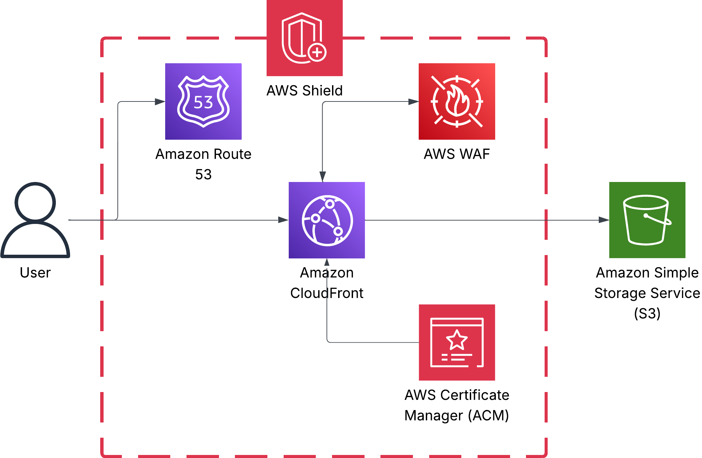
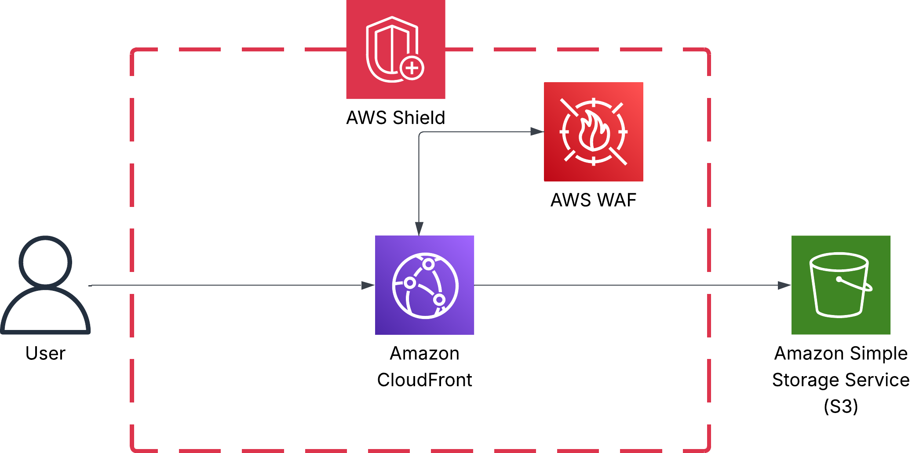
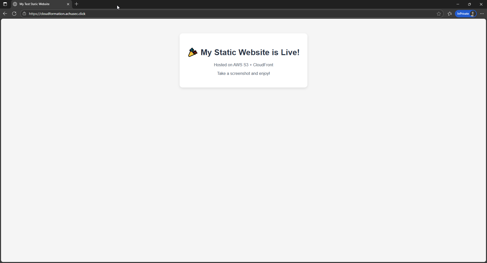

# Secure Global Static Websites on AWS with Terraform & CloudFormation

---

## Table of Contents
- [Overview](#overview)
- [Architecture Diagram](#architecture-diagram)
  - [Private S3 Bucket with ACM](#private-s3-bucket-with-acm)
  - [Public S3 Bucket without ACM](#public-s3-bucket-without-acm)
- [AWS Components Explained](#aws-components-explained)
- [Infrastructure as Code (IaC)](#infrastructure-as-code-iac)
- [IaC Tools: CloudFormation & Terraform](#iac-tools-cloudformation--terraform)
  - [Deployment with Terraform](#deployment-with-terraform)
    - [Prerequisites](#0-prerequisites)
  - [Deployment with CloudFormation](#deployment-with-cloudformation)
    - [Prerequisites](#0-prerequisites-1)
- [Final Product](#final-product)

---

## Overview  
This project provides two ready-to-use architectures for hosting a secure, globally distributed static website on AWS. It leverages S3, CloudFront, Route 53, and ACM to ensure high availability, HTTPS encryption, and custom domain branding.

You can choose between:

1. Private S3 Bucket (with custom domain & ACM) – Recommended if you own a domain and want HTTPS via ACM certificates.

2. Public S3 Bucket (no custom domain) – Simpler setup, intended for testing or use without a custom domain.

Both architectures are implemented in Terraform and CloudFormation so you can pick your preferred Infrastructure-as-Code (IaC) tool.

---

## Architecture Diagram

### Private S3 Bucket with ACM



### Public S3 Bucket without ACM


---

## AWS Components Explained

- **Route 53**  
  AWS’s scalable DNS service that translates your website’s domain name (e.g., www.example.com) into IP addresses, directing user requests to your CloudFront distribution efficiently.

- **CloudFront**  
  AWS’s Content Delivery Network (CDN) that caches your website content at edge locations globally, delivering static assets with low latency and high transfer speeds, improving the user experience.

- **WAF (Web Application Firewall)**  
  Protects your website by filtering malicious HTTP/HTTPS requests such as SQL injections, cross-site scripting (XSS), and other common web attacks before traffic reaches CloudFront and your origin.

- **S3 Bucket**  
  Highly durable object storage (11 9's durability) used to store your website files like HTML, CSS, JavaScript, images, and videos. When combined with CloudFront, it serves as a cost-effective and scalable origin for your static site.

- **Shield**  
  AWS’s managed Distributed Denial of Service (DDoS) protection service. Shield Standard is automatically included at no extra cost and protects your site against common DDoS attacks, helping maintain availability and uptime.

---

## Infrastructure as Code (IaC)

Using IaC is critical for modern cloud deployments because:

1. **No manual console deployments:**  
   Avoid human errors, improve consistency, and accelerate deployments by automating infrastructure provisioning.

2. **Version control with Git:**  
   Infrastructure definitions are treated like code, enabling change tracking, collaboration, and rollback if needed.

3. **Baseline and drift detection:**  
   Easily compare current infrastructure state to desired configuration to identify unauthorized or accidental changes.

---

## IaC Tools: CloudFormation & Terraform

- **CloudFormation:**  
  AWS-native IaC service that allows you to model and provision AWS resources declaratively in JSON or YAML.

- **Terraform:**  
  A popular open-source tool by HashiCorp that supports AWS and other cloud providers, offering a more flexible and human-friendly configuration syntax (HCL).

This repo includes:

- `terraform/` — Terraform configurations
- `cloudformation/` — CloudFormation templates 

### Deployment with Terraform

1. Prerequisites

   - [Install Terraform](https://developer.hashicorp.com/terraform/downloads)
   - [Install AWS CLI](https://docs.aws.amazon.com/cli/latest/userguide/install-cliv2.html)
   - Configure AWS credentials (`aws configure`)
   - Custom Domain – A domain name you own, required if deploying the private S3 bucket with ACM
   - Route 53 Hosted Zone – A hosted zone for your domain must exist in AWS Route 53
   - Route 53 Zone ID – Needed for automatic DNS validation of ACM certificates
   - Optional: [Install Visual Studio Code](https://code.visualstudio.com/download)
   - IAM Permissions – Ensure your AWS account/role has permissions for S3, CloudFront, ACM, Route 53, and IAM (if creating resources with named roles)


2. Clone the repo
 
   ```sh
   git clone https://github.com/AChuSec/aws-static-website-s3.git
   cd aws-static-website-s3
   ```

3. Move to desired Terraform folder

    a. Private S3 Bucket with ACM  
      ```sh
      cd terraform/private-with-acm
      ```

    b. Public S3 Bucket with no ACM  
      ```sh
      cd terraform/public-no-acm
      ```

4. Run `terraform init`

   ```sh
   terraform init
   ```
    
5. Run `terraform plan` to preview changes

   ```sh
   terraform plan
   ```

6. Run `terraform apply` to create resources

   ```sh
   terraform apply
   ```

7. Access the website via the CloudFront URL or your custom domain

8. Run 'terraform destroy' to delete resources

   ```sh
   terraform destroy
   ```

### Deployment with CloudFormation

1. Prerequisites

   - [Install AWS CLI](https://docs.aws.amazon.com/cli/latest/userguide/install-cliv2.html)
   - Configure AWS credentials (`aws configure`)
   - Custom Domain – A domain name you own, required if deploying the private S3 bucket with ACM
   - Route 53 Hosted Zone – A hosted zone for your domain must exist in AWS Route 53
   - Route 53 Zone ID – Needed for automatic DNS validation of ACM certificates
   - Optional: [Install Visual Studio Code](https://code.visualstudio.com/download)
   - IAM Permissions – Ensure your AWS account/role has permissions for CloudFormation, S3, CloudFront, ACM, Route 53, and IAM (if creating resources with named roles)

2. Clone the repo  

   ```sh
   git clone https://github.com/AChuSec/aws-static-website-s3.git
   cd aws-static-website-s3

3. Move to desired CloudFormation folder

    a. Private S3 Bucket with ACM  
      ```sh
      cd cloudformation/private-with-acm
      ```

    b. Public S3 Bucket with no ACM  
      ```sh
      cd cloudformation/public-no-acm
      ```

4. Validate the CloudFormation template (optional)

   ```sh
   aws cloudformation validate-template --template-body file://template.yaml
   ```
    
5. Create the CloudFormation stack

   ```sh
   aws cloudformation create-stack \
    --stack-name my-static-site \
    --template-body file://template.yaml \
    --capabilities CAPABILITY_NAMED_IAM
   ```

6. Update stack (if needed)

   ```sh
   aws cloudformation describe-stacks \
    --stack-name my-static-site \
    --query "Stacks[0].Outputs" \
    --output table
   ```

7. Upload website content to S3

   ```sh
   aws s3 cp index.html s3://<YOUR-BUCKET-NAME>/index.html
   ```   

8. Access the website via the CloudFront URL or your custom domain

   ```sh
    aws cloudformation describe-stacks \
      --stack-name my-static-site \
      --query "Stacks[0].Outputs[?OutputKey=='CloudFrontURL'].OutputValue" \
      --output text
   ```

9. Run 'aws cloudformation delete-stack' to delete resources

   ```sh
   aws cloudformation delete-stack --stack-name my-static-site
   ```

---

## Final Product



Experience a secure, fast-loading, globally available static website powered by AWS!

